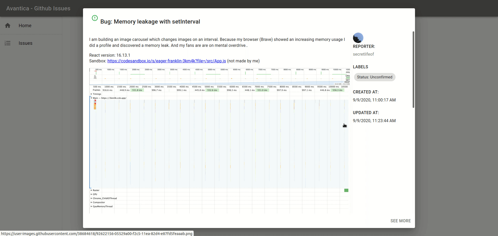

# Avantica - Issues Finder

React Hooks, Material-UI 4 and React-Redux 7 (with hooks!).



## Contains

-   [x] [Material-UI](https://github.com/mui-org/material-ui)
-   [x] [Typescript](https://www.typescriptlang.org/)
-   [x] [React](https://facebook.github.io/react/)
-   [x] [Redux](https://github.com/reactjs/redux)
-   [x] [Redux-Thunk](https://github.com/gaearon/redux-thunk)
-   [x] [Redux-Persist](https://github.com/rt2zz/redux-persist)
-   [x] [React Router](https://github.com/ReactTraining/react-router)

## Roadmap

-   [x] Make function based components and use hooks for state etc.
-   [x] Implement [Material-UIs new styling solution](https://material-ui.com/css-in-js/basics/) based on hooks
-   [x] use react-redux hooks

## How to use

Download or clone this repo

```bash
git clone https://github.com/JulianPorras8/avantica-test.git
cd avantica-test
```

Install it and run:

```bash
npm i
npm start
```

Test:
```bash
npm test
```

## Contributors
-   [Julián Porras](https://github.com/JulianPorras8)

## Warning
To have access to Github GraphQL API you need to generate a `personal access token` according with this guide [Forming calls with GraphQL](https://docs.github.com/en/graphql/guides/forming-calls-with-graphql). Otherwise the calls will fail, the project have a testing token that may be already has expired, please generate a new one.
